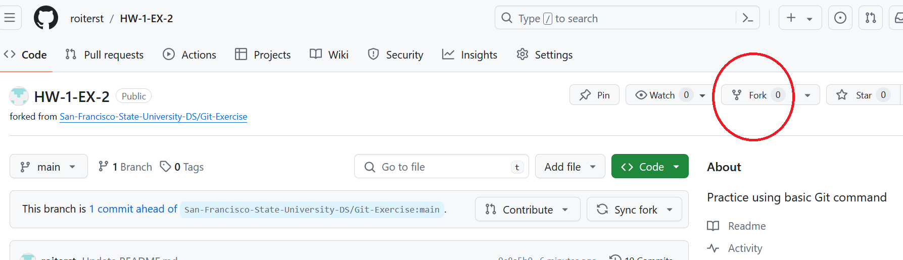
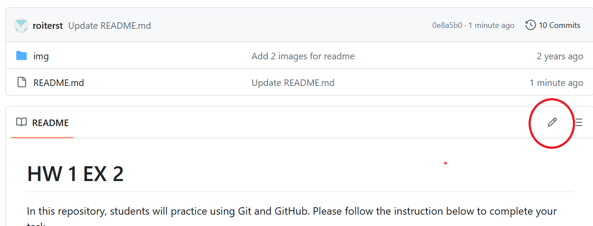

# Git-Exercise

In this repository, students will practice using Git and GitHub. Please follow the instruction below to complete your task.

## Step 1:
Fork this repository to your GitHub.



Clone the repository to your local device.

Use the following command in the termial:

```
git clone <Repo SSH>
```

## Step 2:
Create a new jupyter notebook file and name the file with this pattern: \<Full Name>_test.ipynb

e.g. Norman_Lo_test.ipynb

In this jupyter notebook file, students need to type the following in a code block and write a short comment to describe the code.
  
``` python
x = [10, 20, 30, 40, 50]
y = [1, 2, 3, 4, 5]

result = []
for i in x:
  for j in y:
    result.append(i * j)

print(result)
```
  
**Note:** Make sure you save the file after you finish writing the code and print out the result.

## Step 3:
Push the update to the remote repository on GitHub.

Use the following command:

**Note:** The following command should be in the repository directory.  Make sure you **cd** to the repo directory on your device before running the command below.

i. Adding the update / change to **staging**
```
git add .
```

ii. Committing the update / changes
```
git commit -m '<simple discription of the update / change>'
```
e.g. git commit -m 'add new notebook to the project'

iii. Pushing the update / change back to the cloud or remote repo
```
git push
```

## Step 4:
Add your name to the readme file.



## Step 5:
Pull the updated readme back to the local device.

Use the following command:
```
git pull
```

## Resources:
Git Cheat Sheet: https://education.github.com/git-cheat-sheet-education.pdf
GitHub Documentation: https://docs.github.com/en/repositories
